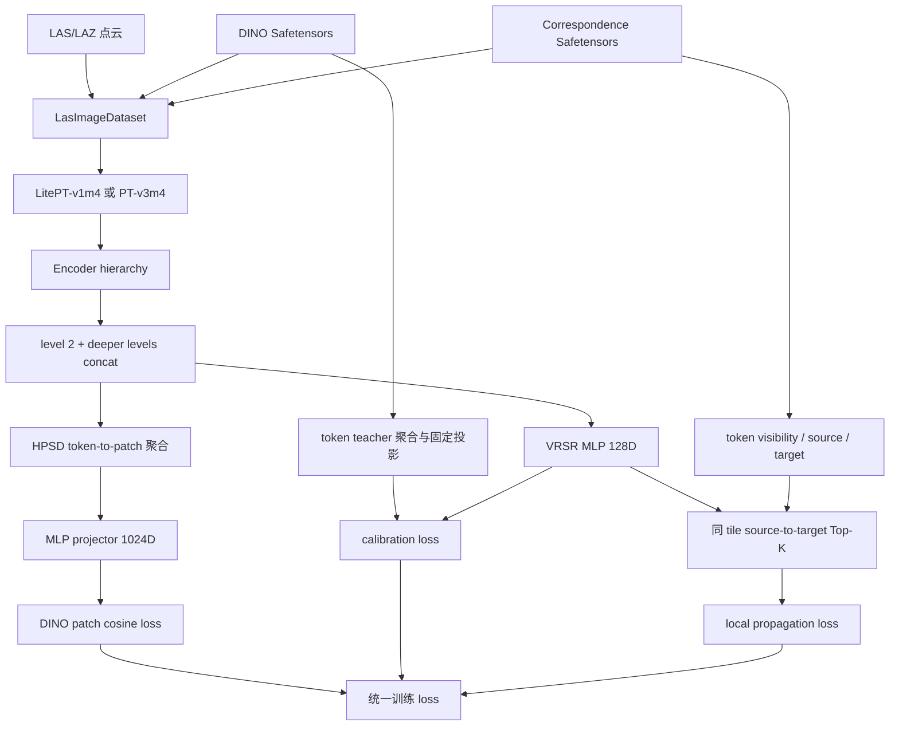

# HPSD-VRSR：面向机载 LiDAR 正射不可视点的视觉监督传播

## 完整设计思想、代码结构与复现指南

## 1. 文档概述

本文面向希望理解、复现或继续开发 PointSpace 中 HPSD-VRSR 的研究人员，完整说明该方案
要解决的问题、理论出发点、数据组织方式、HPSD 与 VRSR 的职责边界、当前代码结构、训练
阶段、测试方法和后续研究方向。文档描述的是当前仓库已经实现并验证的 P0-P3 版本，同时
明确区分尚未实现的 P4-P6，避免把设计路线图误认为现有功能。

HPSD-VRSR 的核心目标，是利用正射影像 DINO 特征预训练机载激光雷达三维网络，同时让
正射影像中不可见、因而没有直接 DINO teacher 的点也能获得合理的语义学习信号。当前
系统不是语义分割器，也不会为不可视点伪造像素对应关系；它是一个训练期表征学习框架。
预训练结束后，可删除监督传播分支，只保留 LitePT 或 PTv3 encoder 以及 HPSD 已训练的
特征表示，用于下游分类、分割或特征分析。

当前实现遵循三个基本原则。第一，原有 concat-HPSD 是已经验证的稳定主分支，新增功能
不能改变它的默认 loss、state dict 命名和特征导出结果。第二，不可视点传播必须具有
明确、可测试的梯度路径，而不是仅依赖 Transformer 的间接上下文扩散。第三，先验证样本
内传播，再考虑可靠度、几何约束和跨样本记忆，避免把多个机制一次加入后无法判断收益来源。

## 2. 研究背景

### 2.1 为什么正射影像不能监督全部机载 LiDAR 点

机载 LiDAR 与正射影像虽然已经坐标对齐，但两者的观测机制不同。正射影像主要记录从上方
可见的表面，例如屋顶、树冠和裸露地表；激光雷达则会记录建筑立面、冠层内部、林下地面和
多回波结构。因而，一个点落在影像空间范围内并不意味着它在正射视角中真实可见。

数据生成阶段以 `dino_valid` 表示点是否具有可用的 DINO patch teacher。开启表面点过滤后，
该字段同时受到影像覆盖和正射可见性的影响。真实湖北数据的完整审计表明，点级 valid 约为
39.65%，即约六成点没有直接视觉监督。经过 level-2 下采样后，42.65% token 完全不包含
valid 点，40.93% token 同时包含可视和不可视点，只有 16.42% token 完全可视。

这种缺失不是均匀随机缺标。归一化高度层审计显示，中间高度层的 fully-invisible 比例约为
50%，明显高于最低层。这与立面、植被内部和遮挡结构的分布相符。因此，简单把最近 DINO
patch 复制给所有不可视点，会把屋顶特征错误赋给立面，把树冠特征错误赋给林下地面。

### 2.2 HPSD 已经解决了什么

HPSD，即 Hierarchical Patch-Set Distillation，负责把原生 1024 维 DINO patch teacher
蒸馏到三维 encoder。它不把每个点直接映射为 1024 维特征，而是在下采样 token 尺度建立
token 与 patch 的多对多稀疏关系，把多个层级的三维特征对齐后 concat，再聚合到实际被
引用的 patch 上执行 projector 和 cosine loss。

这一设计解决了两个关键问题。首先，三维 token 与二维 patch 尺度更接近，避免逐点监督
带来的尺度错位。其次，1024 维 projector 只作用于当前 batch 中真正使用的 patch 聚合
特征，而不是所有原始点，因此显存远小于逐点生成 DINO prediction。

HPSD 只能直接监督至少关联一个 valid 点的 token-patch 结构。完全不可视 token 仍可能
通过共享 backbone 上下文间接学习，但没有显式 loss 保证监督梯度到达它们。VRSR 正是为
这一剩余问题设计的附加分支。

### 2.3 VRSR 的定位

VRSR 在当前代码中可理解为 Visibility-aware Reliable Supervision Reallocation。它不是
对任何一篇论文的逐行复现，而是结合以下工作形成的面向机载 LiDAR 的工程方案：

- [DSP](https://arxiv.org/abs/2107.11267)提出在样本内和样本间重分配特征，使有限监督的
  梯度能够到达未标注位置。VRSR 借鉴其“监督必须真正传播”和“阶段化训练”思想。
- [AIScene](https://openaccess.thecvf.com/content/CVPR2025/html/Liu_Exploring_Scene_Affinity_for_Semi-Supervised_LiDAR_Semantic_Segmentation_CVPR_2025_paper.html)
  区分 scene 内一致性与 scene 间信息利用。VRSR 也先实现样本内分支，再评估跨样本机制。
- [AADNet](https://ojs.aaai.org/index.php/AAAI/article/view/32680)强调二维投影监督的稀疏性
  和空间非均匀性。VRSR 因而显式审计 token visibility，并平衡每个样本的传播范围。
- [RAC-Net](https://arxiv.org/abs/2303.05164)说明单一置信度不足以衡量伪监督可靠性。
  当前 P3 先保留简单机制，后续 P4 才组合 teacher purity、检索 margin、熵和几何信息。
- [DGNet](https://proceedings.neurips.cc/paper_files/paper/2024/hash/38d6af46cca4ce1f7d699bf11078cb84-Abstract-Conference.html)
  使用球面分布和 soft assignment 约束弱监督特征。规划中的 P5 prototype bank 只会借鉴
  这些原则，不会被表述为完整 moVMF/Nested EM 复现。

## 3. 系统总体结构



训练时总损失为：

```text
L_total = L_hpsd + lambda_cal * L_cal + lambda_local * L_local
```

当 `mode="calibrate"` 时，`L_local` 不参与总损失；当 `mode="local"` 时三项共同训练。
推理或特征导出时，VRSR 不执行，调用路径与原 HPSD 相同。

## 4. 数据组织与张量约定

### 4.1 文件布局

`LasImageDataset` 默认读取如下目录：

```text
joint_tiles/
├── pointcloud/
│   ├── tile_0001.las
│   └── ...
├── dino_feature/
│   ├── tile_0001.safetensors
│   └── ...
└── correspondence/
    ├── tile_0001.safetensors
    └── ...
```

三类文件按不含扩展名的 stem 配对。Dataset 不读取原始 GeoTIFF，而只读取已经提取的 DINO
特征和点到 patch 的映射，因此训练阶段没有大影像 I/O。

### 4.2 主要字段

设当前 batch 中输入点数为 `N`，DINO patch 总数为 `P`，teacher 通道为 `Cd=1024`，
目标层 token 数为 `T`，concat 三维通道为 `Ch`。

| 字段 | 形状 | 含义 |
| --- | --- | --- |
| `coord` | `[N,3]` | 变换后的三维坐标 |
| `grid_coord` | `[N,3]` | 稀疏网格坐标 |
| `feat` | `[N,Cin]` | 当前配置为 coord、intensity、echo 拼接 |
| `offset` | `[B]` | 各点云样本的累计点数 |
| `dino_feature` | `[P,1024]` | batch 内拼接的 DINO patch 特征 |
| `dino_patch_index` | `[N]` | 点对应的 batch 全局 patch 行号，无效为 -1 |
| `dino_valid` | `[N]` | 点是否具有有效、可见的 patch teacher |
| `dino_offset` | `[B]` | 各样本 DINO patch 累计数 |
| `input_to_level` | `[N]` | 每个输入点所属的目标层 token |
| `distill_feat` | `[T,Ch]` | level-2 与更深层对齐 concat 后的三维表示 |

项目已有其他数据集使用名为 `correspondence` 的多视角像素字段。`LasImageDataset` 特意使用
`dino_patch_index`、`dino_pixel_coord` 和 `dino_valid`，避免两种语义被模型或 transform
混用。

### 4.3 合批与 patch 索引

单样本 `dino_patch_index` 是该样本内部的一维 patch 索引。`point_collate_fn` 合批时会给
有效索引加上前序样本的 patch 数，使它直接索引拼接后的 `dino_feature`。负一索引保持
不变。HPSD 和 VRSR 都依赖这一合批约定，任何自定义 collate 都必须保留它。

`CompactDinoPatches` 在裁剪、体素采样之后只保留当前点仍引用的 patch，并重写紧凑索引。
这个过程不会改变 DINO 特征值和通道，只减少无用 patch I/O 与显存。

## 5. HPSD 主分支

HPSD 实现位于：

```text
pointspace/models/backbone/hpsd/
├── hierarchy.py
└── hpsd_v1m1.py
```

### 5.1 Encoder hierarchy

LitePT-v1m4 与 PT-v3m4 在 `traceable=True, enc_mode=True` 时保留 pooling parent 和
pooling inverse。`build_encoder_hierarchy()` 从最深层向上恢复 fine-to-coarse hierarchy，
并逐层组合 `pooling_inverse`，得到每个输入点到每一层 token 的 `input_to_level`。

这一统一接口使 HPSD/VRSR 不需要知道 backbone 内部是 LitePT convolution/attention 组合，
还是 PTv3 block。两种网络都返回 `HierarchyLevel(point, input_to_level, level)`。

### 5.2 多层 concat

`fuse_hierarchy_features(hierarchy, target_level)` 以目标层 token 为基准，把所有更深层特征
通过 pooling inverse 无插值地复制回目标层，然后按通道拼接。当前配置为：

```text
LitePT: level 2/3/4 = 144 + 252 + 504 = 900
PTv3:   level 2/3/4 = 144 + 288 + 576 = 1008
```

这里保留的是此前实验效果更好的 concat hierarchical representation。VRSR 不另外定义
`fusion_level`，直接复用 HPSD 的 `distill_level` 和同一 `distill_feat`。

### 5.3 TokenPatchEdges

`build_token_patch_edges()` 只保留 `dino_valid=True` 且 patch index 非负的点，将二维
`(token, patch)` 编码为无碰撞一维 key，再用 `torch.unique` 去重。结果包含：

```text
token:       [E]  每条边的三维 token
patch:       [E]  每条边的 DINO patch
point_count: [E]  支持该 token-patch 关系的点数
```

该结构完整保留 token 到多个 patch、patch 到多个 token 的多对多关系，不退化为最近 patch。

### 5.4 Patch 蒸馏

HPSD 先在三维 `Ch` 空间按边把 token 聚合到 patch。默认边权为
`sqrt(point_count)`，既利用密度信息，又避免高密度区域完全支配聚合。随后只有实际使用的
patch 进入 MLP：

```text
LayerNorm(Ch)
Linear(Ch, 1024)
GELU
Linear(1024, 1024)
```

输出和原生 DINO teacher L2 归一化后计算 `1-cosine`。`sample_balanced=True` 时，先在
每个 tile 内平均 patch loss，再对具有监督的 tile 等权平均，减少 patch 数量差异造成的
样本偏置。

## 6. VRSR 数学设计

### 6.1 Token visibility

对于目标层 token `t`，定义：

```text
q_t = n_valid(t) / n_all(t)
```

其中 `n_all` 是映射到该 token 的输入点数，`n_valid` 是其中具有有效 DINO teacher 的
点数。当前规则为：

```text
source candidate: q_t >= source_q
target:           q_t <= target_q
```

默认 `source_q=0.6`、`target_q=0.0`。因此 P3 只监督 fully-invisible token。混合 token
已经与可视点共享三维表示并能接受 HPSD 监督，第一版不重复把它们作为传播 target。

### 6.2 紧凑 token teacher 与 purity

对于有 token-patch edge 的 token，把关联 DINO patch 聚合为 token teacher：

```text
w_tp      = sqrt(point_count_tp)
d_bar_t   = normalize(sum_p w_tp * dino_p / sum_p w_tp)
support_t = sum_p point_count_tp
```

只为实际具有 teacher 的 token 保存 `d_bar_t`，不会创建稠密 `[T,1024]` tensor。teacher
purity 定义为各 patch 与聚合中心 cosine 的加权均值：

```text
purity_t = sum_p w_tp * cos(dino_p, d_bar_t) / sum_p w_tp
```

purity 衡量一个三维 token 所覆盖多个影像 patch 的视觉一致性。完整湖北数据中 purity 的
p05、p25、p50 分别约为 0.866、0.923、0.966，因此当前配置使用 0.90 作为保守 source
阈值。结合 `q>=0.6`、最小支持点数 4 后，400 个 tile 仍保留约 99.7 万 source token。

### 6.3 为什么需要独立传播空间校准

原 HPSD 约束的是“多个 token 聚合后的 patch feature”与 DINO 的关系，并不保证单个 token
的 concat feature 或任意新建的 128D head 已经具有可靠视觉语义。如果直接使用随机
`prop_head(F_H)` 做 Top-K，邻居关系在训练初期没有语义依据，容易产生 confirmation
collapse。

因此，VRSR 使用固定正交矩阵 `R in R^(1024x128)` 定义稳定 teacher 坐标系：

```text
teacher128_t = normalize(d_bar_t @ R)
student128_t = normalize(prop_head(F_H_t))
L_cal        = mean_t [1 - cos(student128_t, teacher128_t)]
```

`R` 使用固定 seed 生成，作为 buffer 保存到 checkpoint，不进入 optimizer。128D 只服务于
传播检索，不压缩 HPSD 的原生 1024D teacher。`prop_head` 为：

```text
LayerNorm(Ch)
Linear(Ch, 256)
GELU
Linear(256, 128)
```

P2 持续保留 `L_cal`，而不是短暂校准后冻结 head。这样即使 backbone 在 HPSD 和 VRSR
loss 下继续变化，传播坐标系仍被 DINO teacher 锚定。

### 6.4 样本内 Local VRSR

每个 tile 内，从通过 q、support、patch count 和 purity 筛选的 source 中，为 fully-invisible
target 检索 Top-K。source 和 target 都可以设置上限，默认分别为 512 和 1024；超限时按
token z 坐标均匀覆盖地截取，避免只保留低行号或单一高度层。

检索使用 cosine similarity 和温度 softmax：

```text
s_ij = cos(h_target_i, h_source_j)
p_ij = softmax(s_ij / temperature)
r_i  = normalize(sum_j p_ij * stopgrad(h_source_j))
L_local_i = 1 - cos(h_target_i, stopgrad(r_i))
```

实现对每个 batch sample 独立分组，因此 P3 不会在同一个 forward 内跨 tile 取 source。
`chunked_topk_cosine()` 按 query chunk 构造临时 `Cq x S` 相似度矩阵，而不是一次持有完整
`Q x S`。

### 6.5 梯度路径

这是当前实现最重要的正确性约束：

```python
target_train = student128[target_idx]       # 保留梯度
with torch.no_grad():
    target_search = target_train.detach()
    source_search = student128[source_idx].detach()
    reference = build_soft_reference(target_search, source_search)

loss = 1.0 - cosine(target_train, reference)
```

因此：

```text
dL_local / dh_target != 0
dL_local / dF_H_target != 0
dL_local / dh_source = 0
```

source 的视觉语义由 `L_cal` 和 `L_hpsd` 维护，local loss 不会反向拖动 source 去迎合错误
target。测试中专门构造了 source/target，并确认 target 输入特征有非零梯度、source 对
local loss 的梯度为零。

### 6.6 空监督安全性

某个 batch 可能没有 source、没有 target，甚至完全没有有效 DINO 关系。VRSR 不返回一个
与模型无关的常量零，而返回与 student feature 相连的 `feature.sum() * 0`。这样所有参数
仍在计算图中获得零梯度，可保持 `find_unused_parameters=False`，避免 DDP 在不同 rank
监督分布不同时挂起。

## 7. 代码结构

```text
pointspace/
├── datasets/
│   ├── las.py
│   ├── las_image.py
│   └── transform.py                 # CompactDinoPatches
├── models/
│   └── backbone/
│       ├── hpsd/
│       │   ├── hierarchy.py
│       │   └── hpsd_v1m1.py
│       ├── vrsr/
│       │   ├── __init__.py
│       │   ├── ops.py
│       │   └── vrsr_v1m1.py
│       ├── litept_v1/litept_v1m4.py
│       └── point_transformer_v3/point_transformer_v3m4.py
└── engines/
    └── test.py                      # HPSDFeatureTester

configs/hpsd/
├── pretrain-hpsd-litept-v1m4-hubei.py
├── pretrain-hpsd-ptv3-v3m4-hubei.py
├── pretrain-hpsd-vrsr-litept-v1m4-hubei.py
└── pretrain-hpsd-vrsr-ptv3-v3m4-hubei.py

utils/
└── audit_hpsd_visibility.py

tests/
└── models/
    ├── test_hpsd.py
    └── test_vrsr.py
```

### 7.1 `hpsd_v1m1.py`

原 `HierarchicalPatchSetDistiller` 注册名仍是 `HPSD-v1m1`。本轮只增加了
`HPSDTrainContext` 和 `forward_train(..., return_context=True)`。context 保存当前前向
已经存在的 `point`、`hierarchy`、`level`、`distill_feat`、`edges` 和归一化 teacher
引用，不主动复制大 tensor。

正常调用：

```python
result = hpsd(input_dict)
# result: loss, tok, edge, patch
```

附加训练分支调用：

```python
result, context = hpsd.forward_train(input_dict, return_context=True)
```

context 不放入普通 result，因此 `InformationWriter` 不会尝试记录大 tensor。

### 7.2 `ops.py`

`compute_token_visibility()` 用 scatter sum 计算 token 总点数、valid 点数和 q。
`aggregate_patch_teacher_to_tokens()` 生成紧凑 teacher、purity、point support 和 patch
support。`height_stratified_cap()` 对过多 source/target 做确定性高度覆盖截取。
`chunked_topk_cosine()` 以有界显存执行 Top-K。

这些函数不依赖 LitePT 或 PTv3 类，只依赖 hierarchy 和 `TokenPatchEdges`，便于独立单测。

### 7.3 `VisibilityReliableSupervisor`

该类持有 `prop_head`、固定 `teacher_projection` 和全部 VRSR 超参数。`forward()` 的处理
顺序是：计算 visibility，聚合 token teacher，筛 source/target，生成 student128，计算
calibration loss，按 sample 计算 local loss，最后返回 loss 和标量统计。

支持的当前模式只有：

| 模式 | `L_cal` | `L_local` | 用途 |
| --- | --- | --- | --- |
| `calibrate` | 开启 | 关闭 | P2 建立可靠 128D 传播空间 |
| `local` | 开启 | 开启 | P3 训练不可视 token |

### 7.4 `HPSDVRSRDistiller`

该类继承 `HierarchicalPatchSetDistiller`，注册为 `HPSD-VRSR-v1m1`。继承而不是包裹一个
`self.hpsd`，是为了保持已有 checkpoint 的公共键名：

```text
backbone.*
student_projector.*
vrsr.*                    # 新增
```

从原 HPSD checkpoint 初始化时，`CheckpointLoader(strict=False)`只会报告缺少 VRSR 的
固定投影和 head，不会出现公共参数 unexpected key。`return_point_feature=True` 时，新类
直接委托父类，完全跳过 VRSR。

## 8. 配置参数

### 8.1 HPSD 参数

| 参数 | 当前值 | 说明 |
| --- | --- | --- |
| `distill_level` | 2 | 建边和传播所在 encoder 层 |
| `teacher_channels` | 1024 | 保留 DINOv3 ViT-L 原生维数 |
| `edge_weight` | `sqrt_count` | token-patch 聚合权重 |
| `sample_balanced` | True | tile 级等权 HPSD loss |
| `fuse_deeper_features` | True | concat 目标层与更深层 |
| `projector_hidden_channels` | 1024 | HPSD MLP 隐藏维数 |

### 8.2 VRSR 参数

| 参数 | 默认值 | 说明 |
| --- | ---: | --- |
| `mode` | `calibrate` | 默认安全地从 P2 开始 |
| `propagation_channels` | 128 | 传播空间维数 |
| `hidden_channels` | 256 | propagation head 隐藏维数 |
| `projection_seed` | 3407 | 固定 teacher 投影 seed |
| `source_q` | 0.6 | source 最小 token visibility |
| `target_q` | 0.0 | 当前只选择 fully-invisible target |
| `min_source_points` | 4 | source 最小 valid 支持点数 |
| `min_source_patches` | 1 | source 最小关联 patch 数 |
| `source_purity` | 0.90 | DINO patch 一致性阈值 |
| `topk` | 8 | 每个 target 的 source 邻居数 |
| `temperature` | 0.1 | soft reference 温度 |
| `max_sources` | 512 | 每 tile source 检索上限 |
| `max_targets` | 1024 | 每 tile target 训练上限 |
| `query_chunk_size` | 256 | 检索临时 query 数 |
| `lambda_cal` | 0.05 | 校准损失权重 |
| `lambda_local` | 0.02 | local 传播损失权重 |

`source_purity=0.90` 来源于当前湖北数据审计，不应被视为跨数据集常数。更换地区、DINO
模型、影像分辨率、patch size、grid size 或 distill level 后，应重新运行 audit。

## 9. P0：数据覆盖审计

运行 LitePT 审计：

```powershell
& D:/app/Anaconda3/envs/pointcept/python.exe `
  utils/audit_hpsd_visibility.py `
  --config-file configs/hpsd/pretrain-hpsd-vrsr-litept-v1m4-hubei.py `
  --output-dir exp/hpsd_visibility_audit `
  --batch-size 1 `
  --num-workers 4 `
  --device cuda `
  --source-purity 0.90
```

工具执行配置中的真实训练 transform 和 encoder pooling，但不运行 HPSD projector。输出：

```text
visibility_audit.json     # 完整机器可读统计、直方图和高度层
visibility_audit.md       # 便于人工查看的摘要
```

为了避免大数据内存错误，分位数只基于固定容量 priority reservoir；计数和直方图仍使用全量
token，因此比例统计不是抽样值。当前全量结果位于：

```text
exp/hpsd_visibility_audit_full_p09/
```

当前结果：

| 指标 | 数值 |
| --- | ---: |
| tile | 400 |
| 变换后点数 | 49,396,710 |
| 点级 valid | 39.65% |
| level-2 token | 7,088,569 |
| fully-invisible token | 42.65% |
| mixed token | 40.93% |
| fully-visible token | 16.42% |
| 筛选后 source token | 996,961 |
| 同时具有 source/target 的 tile | 400/400 |

## 10. 分阶段训练

### 10.1 训练前提

VRSR 不应从随机 HPSD 直接开启 local propagation。正确顺序是先获得已收敛的 concat-HPSD
checkpoint，再训练 propagation calibration，最后开启 Local VRSR。当前工作区中配置所写
的 HPSD checkpoint 文件并不存在，因此实际运行前必须把 `weight` 指向真实文件。

### 10.2 P2：Calibration

两份新配置默认已经是：

```python
model.vrsr.mode = "calibrate"
```

LitePT 示例：

```powershell
& D:/app/Anaconda3/envs/pointcept/python.exe `
  tools/train.py `
  --config-file configs/hpsd/pretrain-hpsd-vrsr-litept-v1m4-hubei.py `
  --num-gpus 1 `
  --options `
  weight="<已训练的 concat-HPSD checkpoint>" `
  save_path="exp/hubei/hpsd/pretrain-litept-v1m4-vrsr-calibrate"
```

P2 重点观察 `pcos`。随机 head 初始 `pcos` 通常接近 0；它应在训练中持续上升并趋于稳定。
同时应确认 HPSD loss 没有明显恶化。校准阶段 `loc=0`、`acc=0` 是正常行为。

### 10.3 P3：Local propagation

P2 通过后，从其 checkpoint 启动 P3：

```powershell
& D:/app/Anaconda3/envs/pointcept/python.exe `
  tools/train.py `
  --config-file configs/hpsd/pretrain-hpsd-vrsr-litept-v1m4-hubei.py `
  --num-gpus 1 `
  --options `
  model.vrsr.mode="local" `
  weight="<P2 calibration checkpoint>" `
  save_path="exp/hubei/hpsd/pretrain-litept-v1m4-vrsr-local"
```

PTv3 使用对应的 `pretrain-hpsd-vrsr-ptv3-v3m4-hubei.py`。两份配置均只使用
`batch_size_train` 和 `batch_size_test`，没有废弃的总 `batch_size`。

P3 不能只根据 local loss 是否下降判断有效。最终应在有类别标签的下游数据上报告全体、
可视子集和不可视子集指标，并至少运行两个 seed。若不可视子集没有稳定提升，应停止继续
堆叠 P4/P5。

## 11. 训练日志

模型只返回标量简称，避免终端单行过长：

| 键 | 含义 |
| --- | --- |
| `loss` | HPSD 与加权 VRSR 的总损失 |
| `hpsd` | 未加权原 HPSD loss，仅用于日志 |
| `cal` | 未加权传播空间 calibration loss |
| `loc` | 未加权 Local VRSR loss |
| `tok` | 目标层 token 数 |
| `edge` | 去重 token-patch edge 数 |
| `patch` | HPSD 实际监督 patch 数 |
| `src` | 通过条件的 source token 数 |
| `tgt` | fully-invisible target token 数 |
| `acc` | 当前实际参与 local loss 的 target 数 |
| `pcos` | source student128 与 teacher128 平均 cosine |
| `ent` | Top-K soft 权重归一化熵 |

`hpsd/cal/loc` 在输出中已经 detach，Trainer 只对统一 `loss` 反向，避免同一损失被重复
计入梯度。

## 12. 特征导出

训练后的 HPSD-VRSR 仍通过统一入口导出：

```powershell
& D:/app/Anaconda3/envs/pointcept/python.exe `
  tools/test.py `
  --config-file configs/hpsd/pretrain-hpsd-vrsr-litept-v1m4-hubei.py `
  --num-gpus 1 `
  --options `
  weight="<HPSD-VRSR checkpoint>" `
  feature_output_dir="<输出目录>"
```

`HPSDFeatureTester` 使用 `GridSample(mode="test")` 把一块点云拆为多个 fragment，分别预测
后依据 `index` 累加回原始点顺序，对重复点取均值并归一化。输出 Safetensors 主张量：

```text
feature: [N, 1024] fp16    # feature_source="projected"
```

或：

```text
feature: [N, Ch]           # feature_source="backbone"
```

VRSR 只在训练前向运行。导出不读取 DINO、correspondence，也不执行 128D propagation head。
真实 fragment 测试已经生成 `[5731,1024]` fp16 特征，并确认全部原始点覆盖且顺序正确。

## 13. 测试体系

运行当前自动测试：

```powershell
& D:/app/Anaconda3/envs/pointcept/python.exe -m pytest `
  tests/engines/test_batch_config.py `
  tests/models/test_hpsd.py `
  tests/models/test_vrsr.py -q
```

当前结果为 `20 passed`。测试覆盖：

- 原 HPSD concat、MLP、稀疏边、patch 聚合、空监督和 sample-balanced loss；
- HPSD 默认前向与返回 context 的 loss 数值一致；
- token visibility、teacher 聚合、purity 与手工结果一致；
- chunked Top-K 与稠密矩阵 Top-K 一致；
- local loss 对 target 有非零梯度，对 source 无 local 梯度；
- 构造跨样本更相似的反例，确认检索不会跨 batch；
- calibrate 模式和完全空监督都能安全反向；
- HPSD-VRSR 导出结果直接复用父类路径。

此外，LitePT 和 PTv3 均完成真实 BF16 forward/backward。PTv3 使用 60,000 点 crop，未出现
OOM、NaN、FlashAttention 或层级映射错误。

## 14. 性能与显存

在 RTX 5070 Ti Laptop GPU 上，用同一 LitePT 真实 batch、相同公共权重和匹配 seed，预热
后六次测得：

| 模型 | 中位 forward+backward | 峰值 allocated memory |
| --- | ---: | ---: |
| 原 HPSD | 0.0987 s | 1322.8 MiB |
| HPSD-VRSR | 0.1104 s | 1573.8 MiB |
| 增量 | +11.9% | +251.0 MiB |

VRSR 只为 level-2 token 生成 128D feature，主要计算复杂度为：

```text
feature storage: O(T * 128)
local retrieval: O(Q * S * 128)
temporary similarity: O(query_chunk_size * S)
```

若显存不足，推荐依次降低 `max_targets`、`max_sources` 和 `query_chunk_size`。最后才考虑把
传播维数从 128 降到 64；不要为了传播分支修改 HPSD 的 1024D teacher。

## 15. 常见问题与诊断

### 15.1 `pcos` 长期接近 0

这通常说明 propagation head 没有完成 DINO 语义校准。应确认加载的是已训练 HPSD
checkpoint、`src` 非零、固定投影被正确恢复、`lambda_cal` 非零。不要在这种状态开启
`mode="local"`。

### 15.2 `src=0`

检查 `source_q`、`source_purity`、最小支持点数和 correspondence。先运行 audit 查看实际
分位数。不要为了让 `src` 非零而无依据地把 purity 降到很低；某个 tile 没有可靠 source
时，P3 跳过该 tile 比错误传播更安全。

### 15.3 `tgt` 很多但 `acc` 固定为 1024

这是 `max_targets=1024` 的预期行为。`tgt` 是全部 fully-invisible token，`acc` 是当前真正
计算 local loss 的上限内 target。高度分层截取会覆盖不同 z 层，而不是取前 1024 行。

### 15.4 `loc` 下降但下游没有提升

local loss 只表示 target 接近了当前 source reference，不证明语义更正确。应检查 P2
校准质量、不可视子集下游指标和 neighbor entropy。若 source 语义或几何不匹配，较低
local loss 也可能代表过度平滑。

### 15.5 加载原 HPSD checkpoint 出现 missing keys

首次从 HPSD 初始化 HPSD-VRSR 时，缺少 `vrsr.teacher_projection` 和 `vrsr.prop_head.*`
是预期现象，训练用 `CheckpointLoader` 默认 `strict=False`。如果出现公共
`backbone.*` 或 `student_projector.*` unexpected/missing key，则 checkpoint 与配置结构
不匹配，不能忽略。

### 15.6 测试时严格加载失败

`HPSDFeatureTester` 对最终测试 checkpoint 严格加载。测试配置为 `HPSD-VRSR-v1m1` 时，应
加载已经包含 `vrsr.*` 的 P2/P3 checkpoint，而不是直接加载原 HPSD checkpoint。原 HPSD
checkpoint 应配合原 `HPSD-v1m1` 配置测试。

## 16. 当前实现边界

当前完成的 P0-P3 已证明以下事项：真实数据具有足够 source/target；HPSD 行为不被破坏；
128D teacher 校准和 local loss 可以正确构图；不可视 target 能收到显式梯度；两种 backbone
可以运行；资源开销处于预算内。

但当前结果还不能证明 VRSR 提高了最终语义分割精度，因为完整 P2/P3 收敛训练和有类别
下游评估尚未执行。它也没有解决“不可视结构在所有可视 source 中都没有语义对应物”的
信息论限制。VRSR 只能利用共享表征结构传播已有视觉先验，不能凭空恢复正射影像从未观测
到的真实外观。

## 17. 后续路线图

### P4：可靠度与机载几何软约束

P4 计划组合 source teacher purity、support、Top-1 similarity、Top-1/Top-2 margin、Top-K
entropy 和 token 几何兼容度。几何项应使用 tile 内归一化高度和 XY 距离形成 soft weight，
不能采用固定米制 hard gate，否则会把真实屋顶-立面或树冠-林下关系完全切断。

P4 只有在 P3 下游不可视子集已经提升后才值得实现。其目标是降低错误传播，而不是用更多
筛选弥补尚未校准的传播空间。

### P5：跨样本 spherical prototype fallback

P5 计划用高质量 source 更新 DDP 同步的 128D 球面 EMA prototype。只有某 tile 缺少可靠
local source 时才使用 prototype soft reference。有 local reference 时默认不混合两种
teacher。该模块是 class-agnostic spherical k-means 简化，不是 DGNet 的完整 moVMF。

### P6：可选跨 tile memory queue

如果 prototype 被证明过度平滑，可保存其他 tile 的高可靠 detached source 和少量几何
摘要，让当前 target 对 queue 做 chunked Top-K。历史 source 没有梯度，因此它仍不等同于
DSP 的双向 live-sample gradient reallocation。P6 不属于当前主线。

## 18. 推荐实验顺序

```text
1. 冻结当前 concat-HPSD baseline 结果
2. P0 audit 并确定 source 阈值
3. P2 calibration，观察 pcos 与 HPSD loss
4. 保存 P2 checkpoint
5. P3 local，从 P2 checkpoint 初始化
6. 冻结线性探测：全体/可视/不可视子集
7. 完整下游微调：全体/可视/不可视子集
8. 至少两个 seed 确认增益超过随机波动
9. 只有 P3 通过，才实现 P4
10. 只有 anchor-poor tile 仍是瓶颈，才实现 P5
```

最小消融应包含原 HPSD、HPSD+calibration、HPSD+calibration+local 三项。Calibration-only
是不可缺少的对照，否则无法判断提升来自额外 head 正则化，还是不可视监督传播本身。

## 19. 相关文档

- `docs/hpsd_vrsr_practical_phased_plan.md`：实施前的阶段决策与 Go/No-Go 条件。
- `docs/hpsd_vrsr_p0_p3_implementation_report.md`：本轮代码实现和真实验证记录。
- `docs/hpsd_vrsr_fusion_plan_evaluation.md`：对早期融合方案的风险评估。
- `docs/hpsd_visibility_supervision_propagation_design.md`：DSP 风格监督传播的早期研究方案。

## 20. 参考资料与官方代码

- Jiacheng Wei et al., [Dense Supervision Propagation for Weakly Supervised Semantic Segmentation on 3D Point Clouds](https://arxiv.org/abs/2107.11267).
- Chuandong Liu et al., [Exploring Scene Affinity for Semi-Supervised LiDAR Semantic Segmentation](https://openaccess.thecvf.com/content/CVPR2025/html/Liu_Exploring_Scene_Affinity_for_Semi-Supervised_LiDAR_Semantic_Segmentation_CVPR_2025_paper.html), [official repository](https://github.com/azhuantou/AIScene).
- Zhiyi Pan et al., [Point Cloud Semantic Segmentation with Sparse and Inhomogeneous Annotations](https://ojs.aaai.org/index.php/AAAI/article/view/32680), [official repository](https://github.com/panzhiyi/AADNet).
- Zhonghua Wu et al., [Reliability-Adaptive Consistency Regularization for Weakly-Supervised Point Cloud Segmentation](https://arxiv.org/abs/2303.05164), [official repository](https://github.com/wu-zhonghua/RAC-Net).
- Zhiyi Pan et al., [Distribution Guidance Network for Weakly Supervised Point Cloud Semantic Segmentation](https://proceedings.neurips.cc/paper_files/paper/2024/hash/38d6af46cca4ce1f7d699bf11078cb84-Abstract-Conference.html), [official repository](https://github.com/panzhiyi/DGNet).

