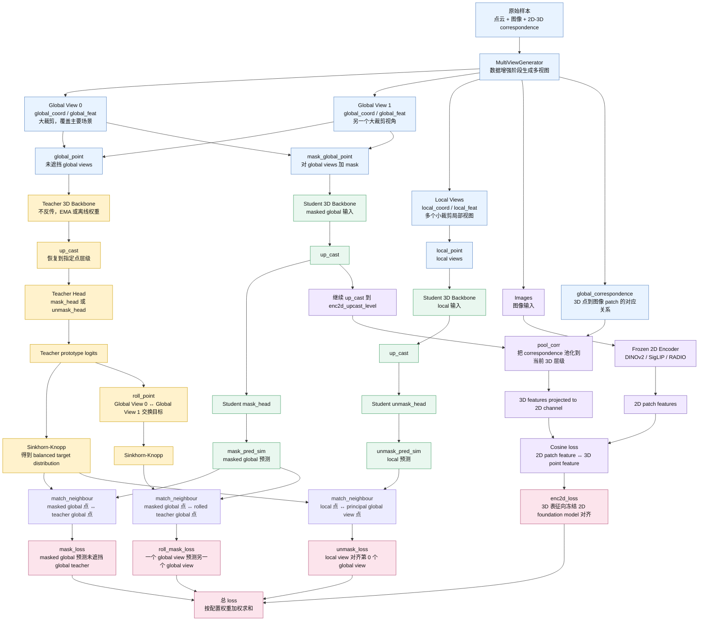

# Utonia 中各种 View 的产生、作用与相互关系

这张图对应 `utonia_v1m1_base.py` 里的训练前向流程，重点解释：

- `global view` 和 `local view` 从哪里来；
- `teacher` 看什么，`student` 看什么；
- `mask_loss`、`roll_mask_loss`、`unmask_loss`、`enc2d_loss` 分别把哪些 view 对齐到哪些目标。

## 总览图



## 这几个 View 到底是什么

### 1. Global View

`global view` 是从同一个原始点云样本中裁出来的“大视野”版本。配置里通常是：

```python
global_view_num = 2
global_view_scale = (0.4, 1.0)
```

意思是每个样本产生 2 个 global view，每个 view 覆盖较大范围。它们被拼成：

- `global_coord`
- `global_feat`
- `global_origin_coord`
- `global_offset`

在 Utonia 里，未遮挡的 global view 主要给 `teacher` 看，用来产生稳定目标。

### 2. Masked Global View

`masked global view` 不是数据增强阶段单独产生的字段，而是在 `forward()` 内部由 `global_point` 变出来的。

代码逻辑是：

```python
global_mask, global_cluster = self.generate_mask(...)
mask_global_point = Point(..., mask=global_mask, ...)
```

也就是说：

- 坐标仍来自 global view；
- 一部分空间 patch 被选中为 mask；
- 被 mask 的点在 backbone embedding 阶段会被替换成 `mask_token`；
- student 只能看“被遮挡后的 global view”。

它对应 `mask_loss` 和 `roll_mask_loss` 的预测输入。

### 3. Local View

`local view` 是同一个样本中的“小视野”裁剪。配置里通常是：

```python
local_view_num = 4
local_view_scale = (0.1, 0.4)
```

它们覆盖范围更小，变化更强，主要给 `student` 看。Utonia 要求 local view 学到的局部表征能对齐到 principal global view 的 teacher 目标。

它对应 `unmask_loss`。

### 4. Principal Global View

`principal global view` 不是新的数据字段，而是 global views 中每个样本的第 0 个 global view。

代码里通过这一句选出来：

```python
principal_view_mask = global_point_.batch % self.num_global_view == 0
```

如果每个样本有 2 个 global view，那么 batch 排列大致是：

```text
sample0_global0, sample0_global1, sample1_global0, sample1_global1, ...
```

其中 `global0` 就是 principal global view。`unmask_loss` 会让 local views 对齐这个主要 global view。

## 四个 Loss 的关系

## 关于两个 Global View 是否都参与 Loss

结论先说：

- 两个 `global view` 都会参与 `mask_loss`。
- 代码里不是显式写 `for global_view in views` 循环，而是把两个 global view 拼在同一个 batch-like 结构里一次性送进 backbone 和 loss。
- `roll_mask_loss` 的效果就是让两个 global view 互相当 teacher target：`global0` 预测 `global1`，`global1` 预测 `global0`。

假设一个样本生成两个 global view：

```text
G0 = global view 0
G1 = global view 1
MG0 = masked global view 0
MG1 = masked global view 1
```

那么 `mask_loss` 的监督关系是：

```text
student(MG0) -> teacher(G0)
student(MG1) -> teacher(G1)
```

也就是说，每个 masked global view 预测自己对应的未遮挡 global view。两个 global view 都会算，只是它们被拼在 `global_coord/global_feat/global_offset` 里统一处理。

`roll_mask_loss` 的监督关系是：

```text
student(MG0) -> teacher(G1)
student(MG1) -> teacher(G0)
```

代码里这个交换由 `roll_point(global_point_)` 完成。注释里也写了类似逻辑：

```python
# [pc1, pc1', pc2, pc2'] -> [pc1', pc1, pc2', pc2]
```

其中 `pc1` 和 `pc1'` 就是一对 global views。交换后再做 `match_neighbour`，所以 masked global view 会和对方 global view 的 teacher 特征匹配并计算 loss。

更形象地看：

```text
普通 mask_loss:

MG0 ---------------> G0 teacher target
MG1 ---------------> G1 teacher target

roll_mask_loss:

MG0 ---------------> G1 teacher target
MG1 ---------------> G0 teacher target
```

这里的箭头表示 student 预测 teacher 的 prototype target。实际计算时还会经过最近邻匹配：

```text
match_neighbour(masked global 点, teacher global 点)
```

所以不是简单按数组同位置硬对齐，而是用 `origin_coord` 在两个 view 之间找空间最近邻，距离超过 `match_max_r` 的点对会被过滤掉。

## enc2d_loss 是点-像素级对齐吗

结论：**不是像素级对齐，也不是严格的一点对一像素监督；它是 patch 级别的 2D-3D 语义蒸馏。**

更准确地说，`enc2d_loss` 做的是：

```text
若干 3D 点特征  --投影/聚合到同一个图像 patch-->  一个 3D patch-aligned 特征
一个图像 patch  --Frozen 2D Encoder-->  一个 2D patch 特征

然后：
3D patch-aligned 特征  <->  2D patch 特征
用 cosine loss 对齐
```

所以它不是：

```text
每个 3D 点 <-> 每个原始像素
```

而是：

```text
投影到同一个 ViT patch 的 3D 点集合 <-> 该图像 patch 的 2D feature
```

在当前配置中：

```python
crop_h = 518
crop_w = 518
patch_size = 14
patch_h = 37
patch_w = 37
```

因此 2D encoder 看到的是 `37 x 37 = 1369` 个 patch token。每个 patch token 大致对应原图上的 `14 x 14` 像素区域，而不是单个像素。

### 点级精细特征为什么能和 patch 级粗特征匹配

可以，但要理解它的含义：这里匹配的不是精细几何，而是语义/外观一致性。

代码里并没有直接拿每个点去和 patch feature 单独算 loss，而是先把投到同一个 patch 的 3D 点聚合起来：

```python
feature3d_mask = torch_scatter.scatter_mean(
    feature3d_mask,
    feature_index,
    dim=0,
    dim_size=feature2d.shape[0],
)
```

这一步的含义是：

```text
同一个图像 patch 下的多个 3D 点特征 -> mean pooling -> 一个 3D 特征
```

然后再用：

```python
feature3d_mask = self.patch_proj(feature3d_mask)
feature2d_mask = feature2d_mask[feature_index]
feature3d_mask = feature3d_mask[feature_index]
loss = (1 - cos(feature2d_mask, feature3d_mask)).mean() * 10
```

也就是说，最终比较的是：

```text
某个 patch 上聚合后的 3D 特征
vs
同一个 patch 的 2D encoder 特征
```

这是一种合理的弱/粗粒度监督，因为 DINOv2/SigLIP/RADIO 这类 2D foundation model 的 patch token 本身也不是像素级标签，而是局部图像区域的语义表征。Utonia 借它给 3D 表征提供“这个区域看起来像什么”的语义参照。

但它也有天然限制：

- 一个 patch 内可能有多个 3D 点，甚至可能来自不同深度或不同物体表面；
- 2D patch 特征比 3D 点特征更粗；
- 因此 `enc2d_loss` 不适合被理解为精确几何监督；
- 它更像是“把 3D 局部表征拉向对应图像区域的语义特征”。

所以，如果 `mask_loss` / `unmask_loss` 更偏向 3D 多视图自监督，那么 `enc2d_loss` 更像是 2D foundation model 对 3D backbone 的语义蒸馏。

## global_correspondence 中包含什么信息

`global_correspondence` 保存的是 **global view 中每个 3D 点在图像 patch 网格上的位置**。

它的核心形状可以理解为：

```text
[N_points, N_images, 2]
```

其中：

- `N_points`：当前 global view 里的点数；
- `N_images`：该样本可用的图像数量，或被 `MultiViewGenerator.match_point_image()` 选中的图像数量；
- 最后一维 `2`：该点投影到图像 patch 网格后的坐标。

最后一维不是原始像素坐标，而是 patch 坐标：

```text
[patch_row, patch_col]
```

如果某个点在某张图里没有有效对应关系，就记为：

```text
[-1, -1]
```

可以把它想象成这样：

```text
global_correspondence[point_i, image_j] = [r, c]

含义：
第 i 个 3D 点在第 j 张图像中，落在 ViT patch 网格的第 r 行、第 c 列。
```

例如：

```text
global_correspondence[123, 0] = [12, 25]
```

表示第 `123` 个 3D 点，在第 `0` 张图像上对应 `37 x 37` patch 网格中的第 `12` 行、第 `25` 列 patch。

如果是：

```text
global_correspondence[123, 0] = [-1, -1]
```

表示这个点在第 `0` 张图像中不可见、被裁掉、投影无效，或没有可用对应。

### correspondence 是怎么变成 patch 索引的

数据加载时，原始 correspondence 通常来自投影关系：

```text
原始图像像素坐标 + 3D 点 index
```

之后会经过裁剪、resize 和 patch 化。代码中会把像素坐标换算成 patch 坐标，并写入：

```python
correspondence_infos[point_id, image_id, :] = [patch_row, patch_col]
```

在 `enc2d_loss` 中，又会把 `[image_id, patch_row, patch_col]` 展平成一维 patch index：

```python
feature_index =
    image_global_offset * patch_h * patch_w
    + image_id * patch_h * patch_w
    + patch_row * patch_w
    + patch_col
```

然后：

- 用这个 index 从 `feature2d` 中取对应 2D patch feature；
- 用同一个 index 把多个 3D 点聚合到对应 patch；
- 最后计算 cosine loss。

### pool_corr 在这里做了什么

backbone 经过 `GridPooling` 后，3D 点数会减少。此时原始点级 correspondence 也要同步到下采样后的点层级。

`pool_corr(point, correspondence)` 做的事情是：

```text
沿着 backbone 的 pooling 记录，把原始点 correspondence 聚合到当前 3D 特征点。
```

如果一个 pooled 点来自多个原始点：

- 对每张图，先看这些原始点里哪些有有效 `[patch_row, patch_col]`；
- 没有有效对应就保持 `[-1, -1]`；
- 有多个有效对应时，对 patch 坐标求平均。

这也再次说明：`enc2d_loss` 是粗粒度 patch 对齐，而不是严格的一点一像素匹配。

### mask_loss

目标：

```text
student(masked global view) -> teacher(unmasked same global view)
```

作用：

- 训练 student 在信息缺失时恢复语义/几何表征；
- 类似 masked modeling；
- teacher 提供未遮挡视图的稳定 prototype target。

### roll_mask_loss

目标：

```text
student(masked global view 0) -> teacher(global view 1)
student(masked global view 1) -> teacher(global view 0)
```

作用：

- 强化两个 global view 之间的一致性；
- 避免模型只记住单个裁剪视图；
- 当前实现主要支持 `num_global_view == 2`。

代码里通过 `roll_point()` 交换两个 global view 的顺序。

### unmask_loss

目标：

```text
student(local views) -> teacher(principal global view)
```

作用：

- 让小裁剪 local view 学到能和大视野 global view 对齐的表征；
- 提升局部到全局的一致性；
- local view 不一定覆盖完整场景，所以需要最近邻匹配过滤掉没有对应关系的点。

### enc2d_loss

目标：

```text
student 3D features -> frozen 2D encoder patch features
```

作用：

- 用 DINOv2/SigLIP/RADIO 这类图像 foundation model 给 3D 表征提供语义约束；
- 通过 `global_correspondence` 找到 3D 点对应的图像 patch；
- 对齐方式是 cosine loss，而不是 prototype cross entropy。

## 一句话理解

Utonia 的 view 关系可以这样记：

```text
Teacher 看完整 global，负责出题；
Student 看 masked global 和 local，负责答题；
2D encoder 看图像 patch，负责给 3D 表征提供语义参照。
```

其中：

- `global view` 是 teacher 的主要目标来源；
- `masked global view` 是 student 的遮挡恢复输入；
- `rolled global view` 是跨 global view 的一致性目标；
- `local view` 是 student 学局部到全局对齐的输入；
- `image patch view` 是 2D-3D 对齐的外部语义教师。
